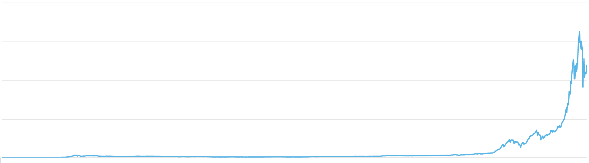

# crypto-tldr

## Motivation
In the beginning there was just one. But now the abundance of coins have made it difficult to keep track of all the Blockchain projects out there. Many project landing pages do a poor job of explaning what they are, often opting to use buzzwords and catchy phrases over clear, concise information. Whitepapers take a long time to read through, and can also sometimes fail to give a proper abstract.

This project aims to provide quick summaries of what projects are, in order to give newcomers and veterans a convenient resource to get a high level overview of what a project does.

Please add projects and descriptions below. Improve or correct existing descriptions as you see fit.

## Contributing
Submit a pull request with changes, or edit this [spreadsheet](https://docs.google.com/spreadsheets/d/1fxZjq5VR_BFnyR13rCBDk5G3_FS-7RRwmngycLc0bYA/edit#gid=0), which will be merged in periodically.

## Crypto Projects
### 0x
Protocol for decentralized exchanges for ERC20 tokens.

### AppCoins
Protocol used to purchase items within mobile apps using blockchain.

### Aragon
A decentralized ompany or organization management. Aims to tackle problems like managing payroll and company administration.

### Augur
Utility token for a prediction market platform.

### Basecoin
Stablecoin using inflation and deflation to stabilize the basecoin token.

### Basic Attention Token
Token for Brave Browser to provide an alternate monetization method to ads.

### Binance Coin
Coin for the Binance exchange which pays for trading fees at a discount.

### Bitcoin
First digital currency.

### Bitcoin Cash
Fork of Bitcoin after community disagreement.

### BitConnect
Ponzi scheme scam.

### Bounty0x
Utility token for bounty platform.

### BPT
Coin for the Blockport Social Trading Exchange.

### Bytecoin
The first currency based on the CryptoNote technology.

### Cardano
Blockchain platform, with an academic approach. Still in development.

### Civic
Identity verification system.

### Cobinhood
Coin for the feeless crypto exchange, Cobinhood.

### ColossusCoinXT
Privacy-focused coin with an environmentally-friendly slant.

### Coss
Coin for the feeless crypto exchange, Coss.

### Dash
Digital cash with tech innovations (masternodes) that allow instant and optionally anonymous sending. Dash sets aside funds for projects which support the Dash ecosystem like marketing.

### Decred
Bitcoin like.

### DigixDAO
Gold backed tokens

### Dogecoin
A meme coin which was a joke but also a low-risk and friendly gateway into the world of cryptocurrencies.

### EOS
Blockchain platform with onchain governance and plans to scale massively. Still in development.

### Ethereum
Blockchain platform for smart contracts.

### Ethereum Classic
Fork of Ethereum after community disagreement over funds stolen through security bug.

### Gas
Gas for NEO

### Gnosis
Prediction market

### Golem
Utility token ecentralized supercomputing platform.

### Icon
An open source ecosystem on the blockchain that allows organizations like government departments, universities, hospitals, and financial institutions to interact without third-party networks that charge transaction fees or delay the process.

### Iconomi
Crypto index funds

### IOTA
Digital currency which uses a DAG (Tangle) instead of a blockchain. There are no transaction fees.

### Kucoin Shares
Coin for the Kucoin exchange which pays for trading fees at a discount.

### Lisk
Smart contracts with Javascript.

### Litecoin
Digital currency almost identical to Bitcoin but with minor improvements.

### MakerDao
Stablecoin using collateral to back the value of the Dai token.

### Monero
Digital currency with anonymized transaction and balances.

### NEM
Blockchain platform aimed at enterprise.

### NEO
Similar to Ethereum but based in China and with partnerships with Chinese organizations.

### OmiseGO
Decentralized network for P2P payments with any currency, both fiat and crypto.

### Oyster Pearl
Websites make money without ads by letting website visitors support an Oyster-backed storage solution. Storage users pay the websites indirectly.

### PIVX
fork of Dash with POS protocol

### Po.et
A shared, universal ledger designed to track ownership and attribution for digital creative assets.

### RaiBlocks
Digital currency with zero fees and instant transactions. One of the most scalable solutions in production.

### Request Network
A layer on top of Ethereum that allows anyone to request a payment, with regulations like taxes built-in.

### Ripple
Peer to peer debt transfer.

### Siacoin
Decentralized storage.

### Sigil
A crowdfunding coin building a feeless crowdfunding platform, with projects funded by the Sigil coin.

### Steem
Utility token for decentralized social networks like Steemit.

### Stellar
Peer to peer debt transfer, initially a fork of Ripple.

### Stellar
Stellar is a platform that connects banks, payments systems, and people. It facilitates currency exchange.

### Storj
Distributed file storage

### TenX
Facilitates spending cryptocurrencies in real life.

### Tether
Digital currency that's supposedly collaterized 1:1 with USD and audited on a regular basis. There are doubts that this claim is true

### VEN
A coin to enhance businesses' supply chains. Helps to stop counterfeit products.

### Verge
Privacy coin with IP obsfucation built-in.

### Waves
A blockchain platform that organizes ICOs.

### Zcash
Digital currency with anonymized transaction and balances.
